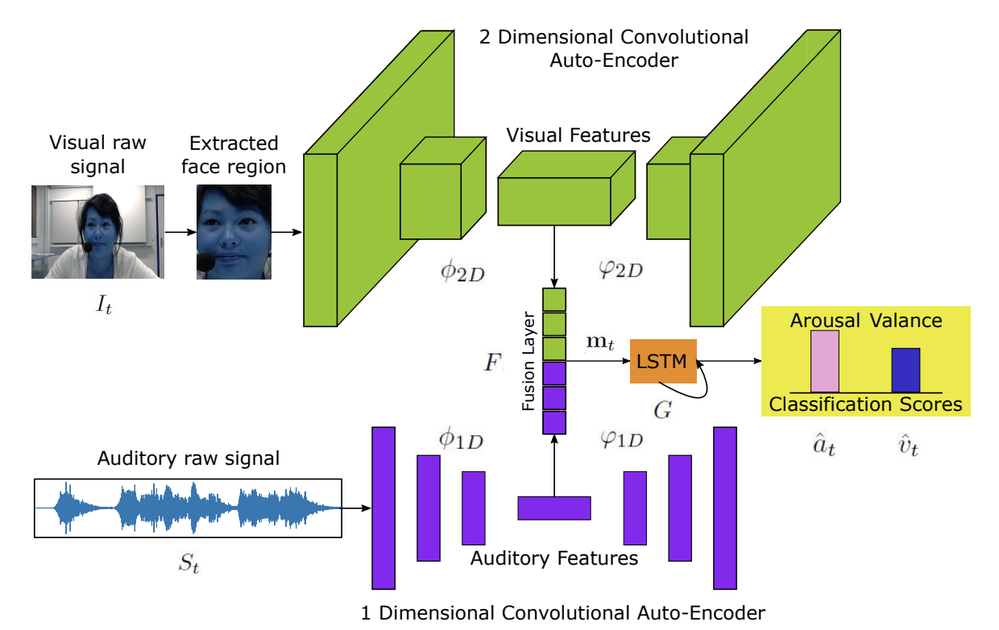
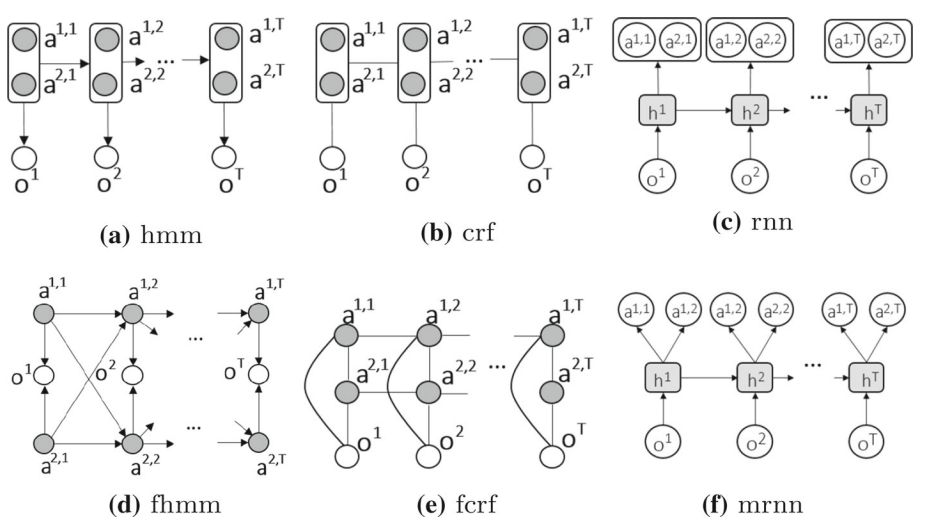
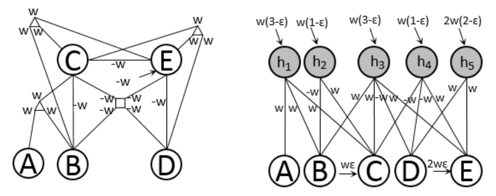
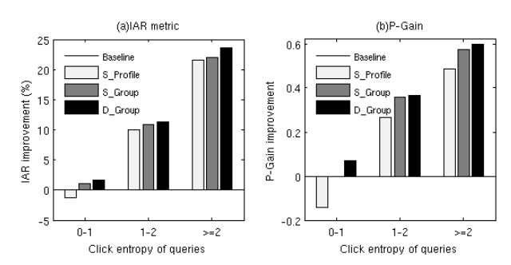
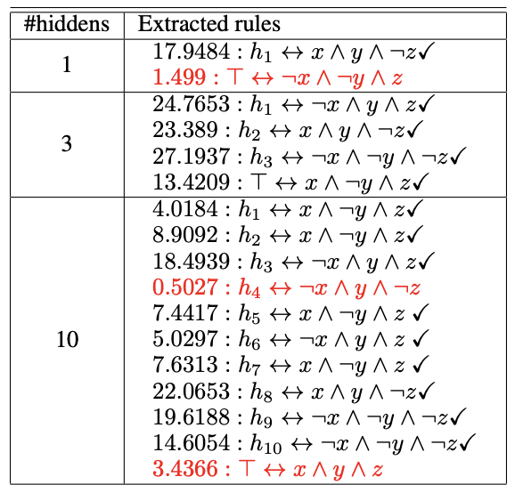

## Recent (selected) papers

For the full list of publications please check my [Google Scholar](https://scholar.google.com.au/citations?user=h82eCK8AAAAJ&hl=en&oi=ao)

### 2021

|  |   **Son N. Tran**, Compositional Neural Logic Programming. Proceedings of the Thirtieth International Joint Conference on Artificial Intelligence, 3059–3066.   [pdf](https://www.ijcai.org/proceedings/2021/0421.pdf)|
|  |   **Son N. Tran** and Artur d'Avila Garcez, Logical Boltzmann Machines. arXiv:2112.05841.   [pdf](https://arxiv.org/pdf/2112.05841.pdf)|
|  |   Renjie Li, **Son N. Tran**, Saurabh Garg, Katherine Lawler, Jane Alty, Quan Bai. arXiv:2112.10275.   [pdf](https://arxiv.org/pdf/2112.10275.pdf)|
|  | Dung Nguyen, Duc Thanh Nguyen, Rui Zeng, Thanh Thi Nguyen, **Son N. Tran**, Thin Khac Nguyen, Sridha Sridharan, Clinton Fookes, Deep Auto-Encoders with Sequential Learning for Multimodal Dimensional Emotion Recognition. IEEE Transactions on Multimedia.   [pdf](https://ieeexplore.ieee.org/stamp/stamp.jsp?arnumber=9374787)|

### 2020

|  |   Regis Riveret\*, **Son N. Tran**\*, Artur d'Avila Garcez. Neural-Symbolic Probabilistic Argumentation Machines.  \* Joint first authors (equal contribution).   [pdf](https://proceedings.kr.org/2020/90/kr2020-0090-riveret-et-al.pdf)|
|  | **Son N. Tran** , Artur d’Avila Garcez , Tillman Weyde, Jie Yin , Qing Zhang, and Mohan Karunanithi. Sequence Classification Restricted Boltzmann Machines with Gated Units. IEEE Transactions on Neural Networks and Learning Systems.   [pdf](https://ieeexplore.ieee.org/stamp/stamp.jsp?tp=&arnumber=8954925)|
|  | **Son N. Tran**, Dung Nguyen, Tung-Son Ngo, Xuan-Son Vu, Long Hoang, Qing Zhang and Mohan Karunanithi. On multi-resident activity recognition in ambient smart-homes. Artificial Intelligence Review.   [pdf](https://link.springer.com/content/pdf/10.1007/s10462-019-09783-8.pdf)|

### 2019

|  | Artur d'Avila Garcez\*, Marco Gori, Luis C Lamb, Luciano Serafini, Michael Spranger, **Son N Tran**. Neural-symbolic computing: An effective methodology for principled integration of machine learning and reasoning. IfCoLog Journal of Applied Logics.  \∗ Corresponding author. Authors are in alphabetical order. .   [pdf](https://link.springer.com/content/pdf/10.1007/s10462-019-09783-8.pdf)|

### Before 2019

| |  **Son N. Tran** and Artur d'Avila Garcez, Deep Logic Network: Inserting and Extracting Knowledge From Deep Belief Networks. IEEE Transaction of Neural Networks and Learning Systems.   [pdf](https://ieeexplore.ieee.org/document/7738566)|
| |  Improving Search Personalisation with Dynamic Group Formation. SIGIR '14: Proceedings of the 37th international ACM SIGIR conference on Research & development in information retrieval.   [pdf](https://dl.acm.org/doi/pdf/10.1145/2600428.2609482)|
| |  **Son N. Tran** and Artur d'Avila Garcez, Knowledge Extraction from Deep Belief Networks for Images. Nesy@IJCAI.   [pdf](https://www.researchgate.net/profile/Son-Tran-11/publication/306783485_Knowledge_Extraction_from_Deep_Belief_Networks_for_Images/links/57bf939808aeb95224d11b36/Knowledge-Extraction-from-Deep-Belief-Networks-for-Images.pdf)|


  You can also find my articles on <u><a href="{{author.googlescholar}}">my Google Scholar profile</a>.</u>





  

