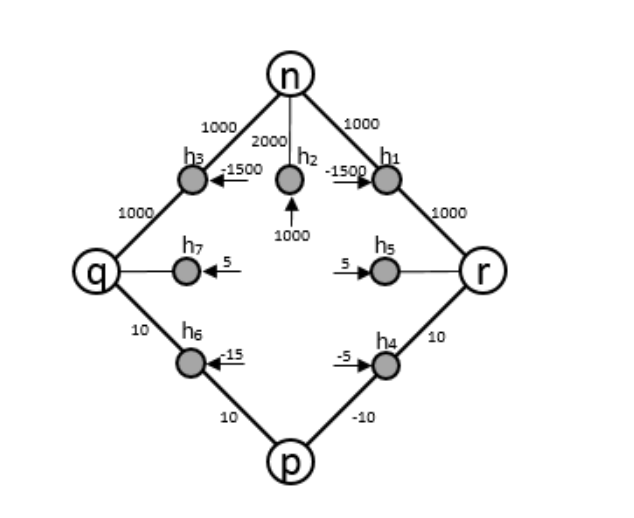
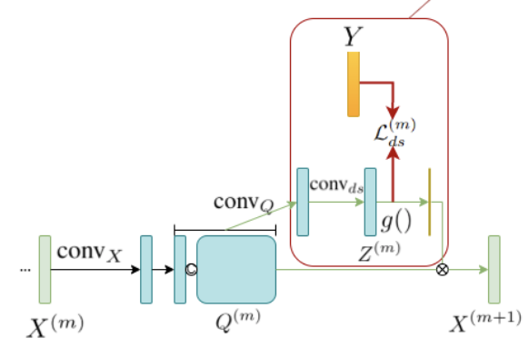
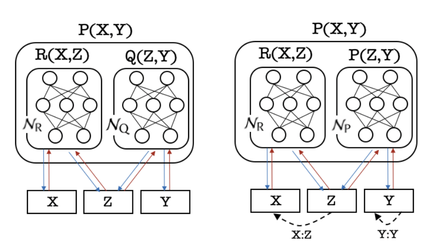
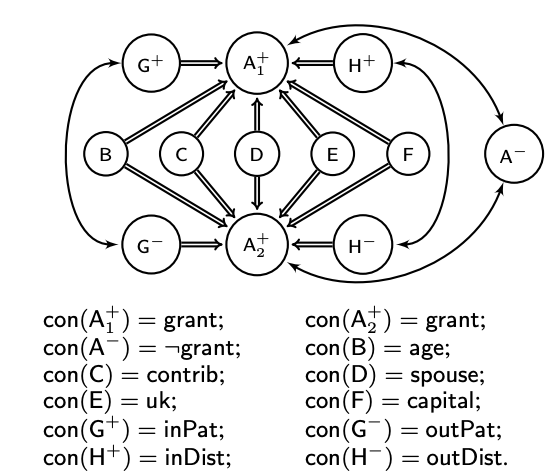
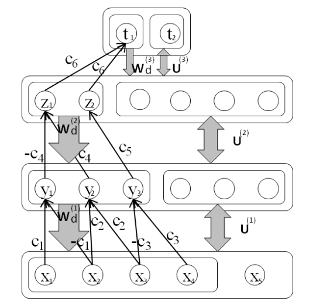

|  |   Son N. Tran and Artur d'Avila Garcez, Logical Boltzmann Machines. arXiv:2112.05841.   [pdf](https://arxiv.org/pdf/2112.05841.pdf)|
|  |   Renjie Li, Son Tran, Saurabh Garg, Katherine Lawler, Jane Alty, Quan Bai. arXiv:2112.10275.   [pdf](https://arxiv.org/pdf/2112.10275.pdf)|
|  |   Son N. Tran, Compositional Neural Logic Programming. Proceedings of the Thirtieth International Joint Conference on Artificial Intelligence, 3059–3066.   [pdf](https://www.ijcai.org/proceedings/2021/0421.pdf)|
|  |   Regis Riveret\*, Son N. Tran\*, Artur d'Avila Garcez. Neural-Symbolic Probabilistic Argumentation Machines.  \* Joint first authors (equal contribution).   [pdf](https://proceedings.kr.org/2020/90/kr2020-0090-riveret-et-al.pdf)|
|  |   Son N. Tran and Artur d'Avila Garcez, Deep Logic Network: Inserting and Extracting Knowledge From Deep Belief Networks. IEEE Transaction of Neural Networks and Learning Systems.   [pdf](https://ieeexplore.ieee.org/document/7738566)|


  You can also find my articles on <u><a href="{{author.googlescholar}}">my Google Scholar profile</a>.</u>





  

